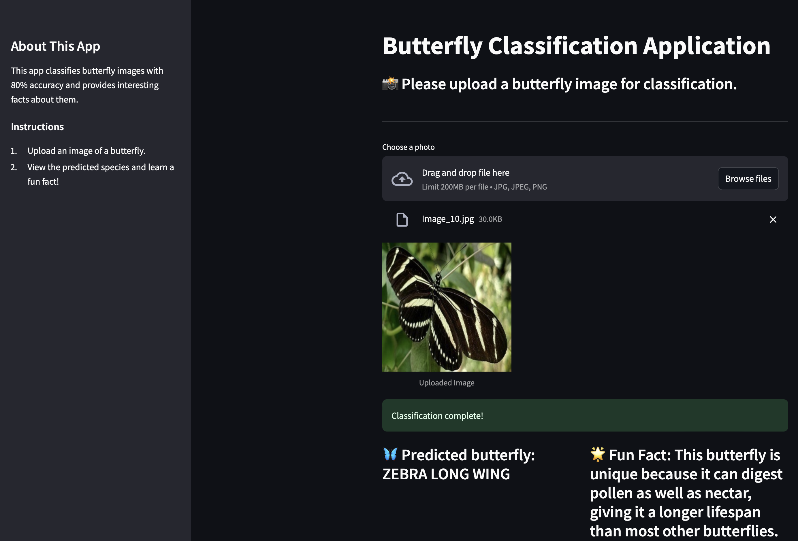

# Butterfly-image-classification
This project utilizes a Convolutional Neural Network (CNN) model to classify butterfly species from images and provides interesting facts about each identified butterfly. Built with TensorFlow and Streamlit, the application allows users to upload a photo of a butterfly, classify it, and learn a fun fact about the species.

## Demo/Screenshot


[Access the application here](https://butterfly-image-classification-h9vj2mmyklnx88hee5nkjt.streamlit.app/)

## Features
- **Image Classification**: Classifies uploaded butterfly images into one of 75 species.
- **Fun Facts**: Displays a unique fact about each butterfly species.
- **Interactive Interface**: Users can easily upload photos and view results in an aesthetic interface.
- **Sidebar Information**: Detailed instructions and additional app information are available in the sidebar for a user-friendly experience.

## Usage
Visit the [Butterfly Classification Application](https://butterfly-image-classification-h9vj2mmyklnx88hee5nkjt.streamlit.app/), upload a butterfly image, and the app will classify the butterfly species and display a fun fact.

## Model Information
- **Model Architecture**: Convolutional Neural Network (CNN) created in TensorFlow, trained for classifying butterfly species.
- **Input Preprocessing**: Images resized to 128x128 pixels, normalized for optimal model performance.
- **Classes**: 75 butterfly species.
- **Final Model Accuracy**: 80%

## Project Structure
- `Butterfly_cnn.ipynb`: Jupyter notebook used for model training.
- `butterfly_data.py`: Python file containing butterfly species facts.
- `butterfly_model.keras`: Saved CNN model file.
- `class_order.json`: JSON file specifying butterfly species in order.
- `main.py`: Streamlit application code.
- `requirements.txt`: Dependencies required to run the application.
- `Resources`: Directory containing the butterfly dataset used for training.

## Dependencies
- Python libraries:
  ```python
  tensorflow==2.17.0
  streamlit==1.39.0
  numpy==1.26.0
  pandas==2.2.3
  matplotlib==3.8.4
  seaborn==0.12.2
  scikit-learn==1.4.2
  requests==2.32.2

## Acknowledgments and Credits
The butterfly dataset used in this project is sourced from Kaggle’s [Butterfly Image Classification dataset](https://www.kaggle.com/datasets/phucthaiv02/butterfly-image-classification/data)

## Future Improvements
- **Additional Butterfly Species**: Expanding the dataset to classify more species.
- **Improved Accuracy**: Using more computational resources could improve the accuracy further.
- **UI Enhancements**: Additional visual features to improve the user interface and user experience.